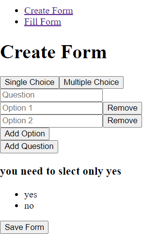

# Dynamic Form Creator

## Overview

This project is a dynamic form creator that allows users to create and fill out forms with single and multiple choice options. The application is built with React for the frontend and Node.js with MongoDB for the backend.

## Features

- **Create Form**: Users can create forms with both single choice and multiple choice questions.
- **Fill Form**: Users can fill out the created forms.
- **Dynamic Options**: Add or remove options for each question dynamically.
- **Save Form**: Save the created form to the database.

## Technologies Used

- **Frontend**: React
- **Backend**: Node.js
- **Database**: MongoDB
- **Other Tech Stacks**:
  - Express.js for server-side logic
  - Mongoose for MongoDB object modeling

## Screenshots

### Prerequisites

- Node.js
- MongoDB
